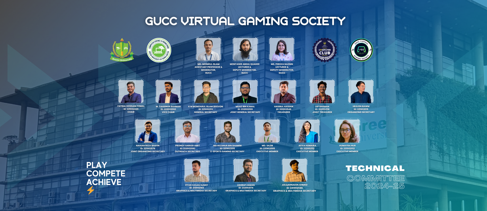
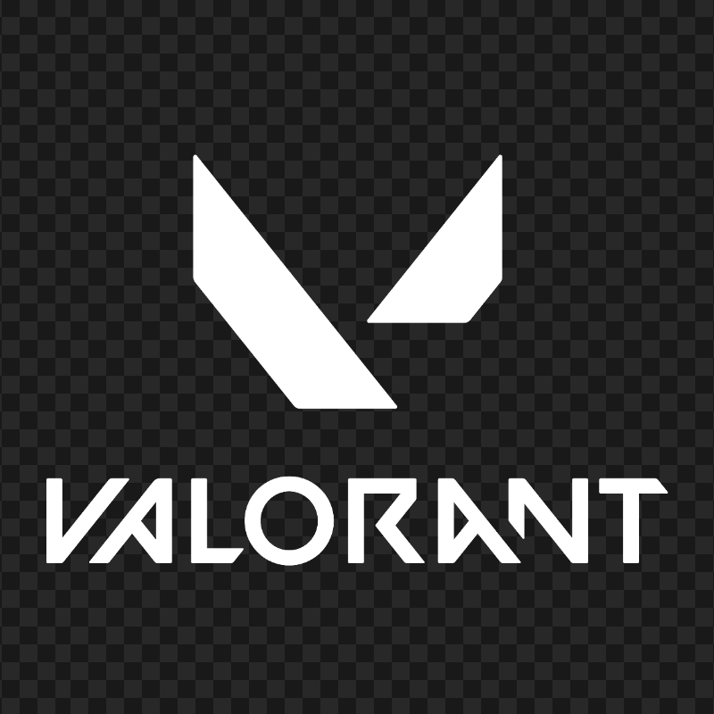
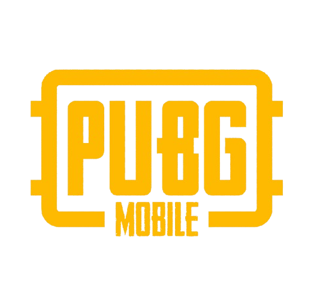
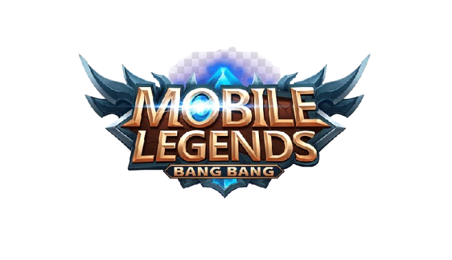
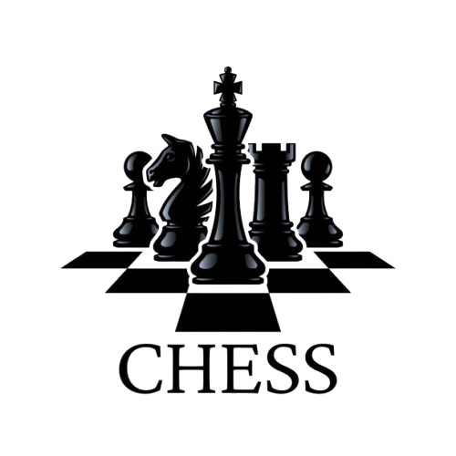
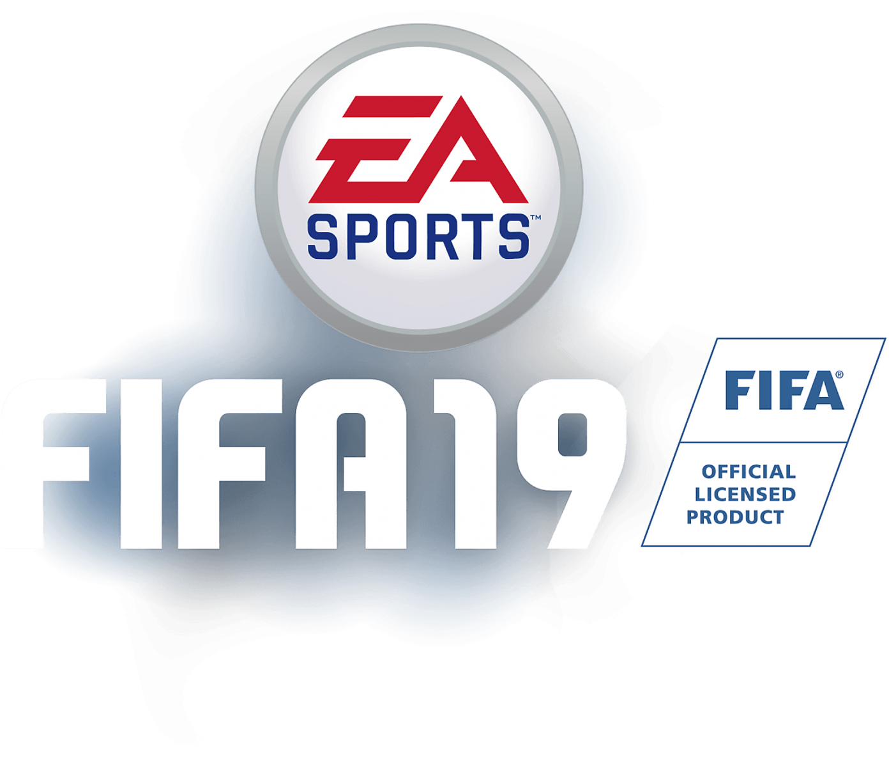
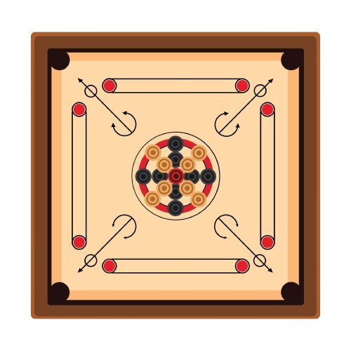

# 🎮 GUCC Virtual Gaming Society (VGS)

<div align="center">
  


[](https://github.com/gucc-vgs)
[](https://github.com/gucc-vgs)
[](https://github.com/gucc-vgs)
[](https://github.com/gucc-vgs)

<h3>🏛️ Green University of Bangladesh's Official E-Sports & Gaming Club</h3>

<p>
  
</p>

[](https://www.facebook.com/gucc.vgs)
[](https://discord.gg/example)
[](mailto:faysaltomal02@gmail.com)

</div>

---

## 🌟 About GUCC VGS

GUCC Virtual Gaming Society (VGS) is **Green University of Bangladesh's official first-ever e-sports and gaming club**, established in 2025. We are pioneering the gaming culture at GUB, bringing together passionate gamers, tech enthusiasts, and competitive players under one unified community.

### 🎯 Our Mission
- 🚀 **Foster Gaming Excellence**: Develop competitive gaming skills and sportsmanship
- 🤝 **Build Community**: Create an inclusive environment for all gaming enthusiasts
- 🏆 **Competitive Gaming**: Organize and participate in local and international tournaments
- 📚 **Education & Growth**: Promote gaming literacy, technology awareness, and career development
- 🌐 **Industry Connection**: Bridge the gap between academia and the gaming industry

---

## 🎮 Gaming Divisions

<div align="center">

| Platform | Category | Featured Games | Competitive Level |
|----------|----------|---------------|-------------------|
| 🖥️ **PC Gaming** | FPS, Sports, Strategy | VALORANT, FIFA 19 | Pro/Semi-Pro |
| 📱 **Mobile Gaming** | Battle Royale, MOBA, FPS | CODM, PUBG Mobile, Mobile Legends | Tournament Ready |
| 🎯 **Traditional Games** | Board Games, Sports | Chess, Carrom, Table Tennis | Recreational/Competitive |
| 🔥 **Trending Games** | New Releases | Free Fire, eFootball | Growing Community |

</div>

### 🏅 Featured Games

<div align="center">

<table>
<tr>
<td align="center">

<br><strong>VALORANT</strong>
<br><sub>5v5 Tactical FPS</sub>
</td>
<td align="center">

<br><strong>CODM</strong>
<br><sub>Mobile FPS/BR</sub>
</td>
<td align="center">

<br><strong>PUBG Mobile</strong>
<br><sub>Battle Royale</sub>
</td>
<td align="center">

<br><strong>ML: Bang Bang</strong>
<br><sub>MOBA</sub>
</td>
</tr>
<tr>
<td align="center">

<br><strong>Chess</strong>
<br><sub>Strategy Board Game</sub>
</td>
<td align="center">

<br><strong>FIFA 19</strong>
<br><sub>Football Simulation</sub>
</td>
<td align="center">

<br><strong>Free Fire</strong>
<br><sub>Mobile Battle Royale</sub>
</td>
<td align="center">

<br><strong>Carrom</strong>
<br><sub>Traditional Board Game</sub>
</td>
</tr>
</table>

</div>

---

## 🏢 Industry Partners & Collaborators

<div align="center">

### 🤝 Our Trusted Partners

<table>
<tr>
<td align="center">

<br><strong>GIGABYTE AORUS</strong>
<br><sub>Main Sponsor</sub>
</td>
<td align="center">

<br><strong>PC Builder BD</strong>
<br><sub>Tech Partner</sub>
</td>
<td align="center">

<br><strong>Trend Beat</strong>
<br><sub>Media Partner</sub>
</td>
</tr>
<tr>
<td align="center">

<br><strong>ESN Bangladesh</strong>
<br><sub>E-Sports Partner</sub>
</td>
<td align="center">

<br><strong>NextGen</strong>
<br><sub>Technology Partner</sub>
</td>
<td align="center">

<br><strong>Royal Moon</strong>
<br><sub>Gaming Partner</sub>
</td>
</tr>
</table>

</div>

---

## 👥 Leadership Team

<div align="center">

### 🎖️ Moderation Panel

| Name | Role | Contact |
|------|------|---------|
| **Md. Monirul Islam** | Moderator | [📧](mailto:monirul@cse.green.edu.bd) |
| **Montaser Abdul Quader** | Deputy Moderator | [📧](mailto:montaser@cse.green.edu.bd) |
| **Ms. Feroza Naznin** | Deputy Moderator | [📧](mailto:feroza@cse.green.edu.bd) |

### 🏆 Executive Wing

| Position | Name | Social Links |
|----------|------|--------------|
| **Chair** | Faysal Hossain Tomal | [📧](mailto:faysaltomal02@gmail.com) [💼](https://www.linkedin.com/in/faysaltomal/) [🐙](https://github.com/FaysalHT) [📘](https://www.facebook.com/FaysalHT02) |
| **Vice Chair** | M. Tahsinur Rahman | [📧](mailto:ariyanrahman1713@gmail.com) [💼](https://www.linkedin.com/in/m-tahsinur-rahman62) [🐙](https://github.com/Aruuu62) |
| **General Secretary** | K M Monoarul Islam Shovon | [📧](mailto:shovon2565@gmail.com) [💼](https://www.linkedin.com/in/k-m-shovon/) [🐙](https://github.com/Shovon25657) |
| **Joint General Secretary** | Muaz Ibn Kamal | [📧](mailto:muazibnkamal8@gmail.com) [💼](https://www.linkedin.com/in/muaz-ibn-kamal-26252735a/) [🐙](https://github.com/MuazibnKamal) |
| **Treasurer** | Hasibul Hassan | [📧](mailto:hasibulgreen@gmail.com) |
| **Joint Treasurer** | Dip Barman | [📧](mailto:dipbarman1212@gmail.com) [💼](https://www.linkedin.com/in/dipbarman) |
| **Organizing Secretary** | Heaven Bawm | [📧](mailto:heavenbawm77@gmail.com) |

</div>

---

## 📊 Club Statistics

<div align="center">

```
🎯 Active Members: 16+          🏆 Tournaments Hosted: 2+
🎮 Games Supported: 8+          🤝 Industry Partners: 6+
📅 Established: 2025            🌟 Achievement Level: Rising
```


</div>

---

## 🎯 How to Join GUCC VGS

<div align="center">

### 🚪 Become Part of the Gaming Revolution

1. **📝 Application**: Contact us through our social media or email
2. **🎮 Skills Assessment**: Demonstrate your gaming skills and passion
3. **🤝 Interview**: Meet with our executive team
4. **🎉 Welcome**: Join our growing community of gamers!

### 💡 What We Offer

- 🏆 **Tournament Participation**: Represent GUB in national and international competitions
- 🎓 **Skill Development**: Professional coaching and training sessions
- 🌐 **Networking**: Connect with industry professionals and fellow gamers
- 🎁 **Exclusive Benefits**: Access to gaming events, workshops, and prizes
- 📈 **Career Growth**: Opportunities in gaming industry and e-sports

</div>

---

## 🛠️ Website Technologies

This modern website is built with cutting-edge technologies:


### ✨ Key Features
- **Single-Page Application (SPA)**: Seamless navigation with custom router
- **Dynamic Content**: JSON-driven data loading
- **Fully Responsive**: Perfect on all devices
- **Interactive UI**: Smooth animations and modern design
- **Performance Optimized**: Fast loading and efficient code

---

## 🏁 Getting Started

### Local Development

1. **Clone the repository**
   ```bash
   git clone https://github.com/gucc-vgs/website.git
   cd website
   ```

2. **Start local server**
   ```bash
   python3 -m http.server 8000
   ```

3. **Open in browser**
   ```
   http://localhost:8000
   ```

---

## 🤝 Contributing

We welcome contributions from the community! Here's how you can help:

1. **🍴 Fork the Project**
2. **🌟 Create your Feature Branch** (`git checkout -b feature/AmazingFeature`)
3. **💾 Commit your Changes** (`git commit -m 'Add some AmazingFeature'`)
4. **📤 Push to the Branch** (`git push origin feature/AmazingFeature`)
5. **🔄 Open a Pull Request**

---

## 📞 Get In Touch

<div align="center">

### 🌐 Connect With Us

| Platform | Link | Purpose |
|----------|------|---------|
| 📧 **Email** | [faysaltomal02@gmail.com](mailto:faysaltomal02@gmail.com) | Official Communication |
| 📘 **Facebook** | [GUCC VGS](https://www.facebook.com/gucc.vgs) | Community Updates |
| 💬 **Discord** | [Join Server](https://discord.gg/example) | Gaming & Chat |
| 📍 **Location** | Green University of Bangladesh, Dhaka | Physical Address |

</div>

---

<div align="center">

### 🎮 "Level Up Your Gaming Journey With GUCC VGS" 🎮


---

<sub>⭐ **Star this repository if you're interested in joining or supporting GUCC VGS!** ⭐</sub>

<sub>🔗 **Share this profile to spread the word about our gaming community!** 🔗</sub>

---

**© 2025 GUCC Virtual Gaming Society | Green University of Bangladesh**
*Building the Future of Gaming, One Player at a Time* 🚀
</div>
